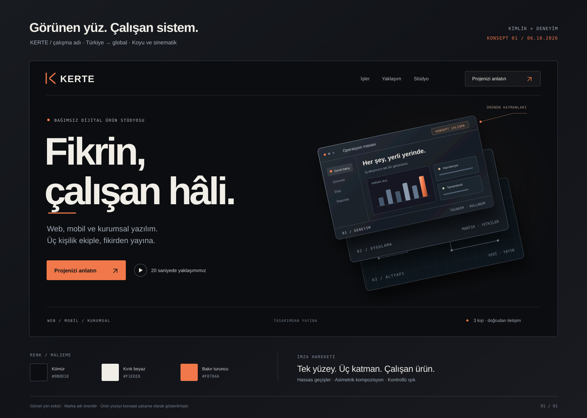

# Dijital ürün stüdyosu — Kimlik ve deneyim konsepti

**Sürüm:** 0.1 · 6 Ekim 2026  
**Çalışma adı:** KERTE · İsim henüz seçilmedi.

## 1. Yön

Kullanıcıyla netleşen tercihler:

- İlk pazar Türkiye; marka ve içerik yapısı sonradan globale açılacak.
- Görsel karakter koyu, sinematik ve premium.
- Bu aşamanın çıktısı kimlik ve konsept.
- Üç kişilik ekip; web siteleri, web uygulamaları, mobil ve kurumsal uygulamalar konusunda deneyim.
- Yayınlanabilir gerçek projeleri, özgün konsept çalışmalarla destekleyen bir vitrin.
- Yaklaşımı anlatan 20 saniyelik Remotion filmi.
- Kısa, cevaplara göre uyarlanan ve teklif hazırlığını kolaylaştıran proje formu.

### Önerilen konumlandırma

> Fikirleri, işletmelerin ve insanların gerçekten kullanabileceği dijital ürünlere dönüştüren üç kişilik bağımsız ürün stüdyosu.

Müşterinin satın aldığı değer: doğru kapsam, iyi tasarım, sağlam uygulama ve yayına kadar sahiplenme.

**Ana mesaj:** Fikrin, çalışan hâli.

**Destek mesajı:** Web, mobil ve kurumsal yazılım. Üç kişilik ekiple, fikirden yayına.

**Doğrudan iletişim mesajı:** Birlikte çalışacağınız ekip, ürününüzü geliştiren ekip.

Birincil müşteri önerisi: somut bir iş hedefi olan, mevcut süreçlerini iyileştirmek veya yeni bir dijital ürün çıkarmak isteyen şirketler ve kurucular. Sektör ve minimum proje büyüklüğü, ticari konumlandırmanın sonraki kararı.

## 2. İsim yönleri

| Aday | Çağrışım | Bu markaya katkısı |
| --- | --- | --- |
| **KERTE** | Yön, derece, ölçü, ilerleme | Teknik hassasiyet ile tasarımı buluşturur. Beş harfli; Türkçe karakter içermez. İlk öneri. |
| **ÖBEK** | Bir araya gelen parçalar ve insanlar | Küçük ekibin birlikte ürettiği bütün fikrini taşır. Daha sıcak ve kolektif bir karakter. |
| **ÇEPER** | Bir yapının sınırı ve katmanları | Mimari ve derinlik hissi güçlü. Daha deneysel, tasarım odaklı bir karakter. |

**Önerilen kullanım:** KERTE / Dijital Ürün Stüdyosu  
**İngilizce tanım:** Independent Digital Product Studio  
**İngilizce mesaj yönü:** From idea to working product.

İsim, ekip büyüse veya yeni bir platformda üretim başlasa da kapsayıcı kalmalı. Üç kişilik yapı, marka hikâyesinin bugünkü somut gerçeği olarak iletişimde yer alır.

### Ön tarama notu

Yontu ve Yonta, uygulama ve yaratıcı teknoloji stüdyoları tarafından kullanıldığı görüldüğü için elendi. KERTE'nin dil ve konsept uyumu güçlü; bu dosya alan adı veya marka tescil müsaitliğini doğrulamaz. Kısa listedeki adayların alan adı, sosyal hesap ve marka uygunluğu seçim aşamasında ayrıca kontrol edilmeli.

## 3. Görsel fikir: Görünen yüz, çalışan sistem

Bir dijital ürünün zarif arayüzü, ziyaretçinin ilk gördüğü yüzeydir. Kontrollü bir hareketle yüzey üç katmana açılır:

1. **Deneyim:** Tasarım, arayüz, kullanıcı akışı.
2. **Uygulama:** İş kuralları, yetkiler, entegrasyonlar.
3. **Altyapı:** Veri, performans, yayın ve izleme.

Katmanlar yeniden birleştiğinde ortaya tek, kullanılabilir bir ürün çıkar. Bu hareket; açılış görselinde, filmde, iş detaylarında ve proje formunun özetinde markanın imzası olur.



### Görsel dil

| Öğe | Yön |
| --- | --- |
| Ana zemin | Kömür siyahı — `#0B0D10` |
| Yükselen yüzey | Soğuk grafit — `#171B22` |
| Ana yazı | Sıcak kırık beyaz — `#F1EEE8` |
| İkincil yazı | Açık çelik — `#A5ADB9` |
| Vurgu | Bakır turuncu — `#F0784A` |
| Ana tipografi | Manrope; büyük, sıkı, net başlıklar ve okunabilir gövde metni |
| Teknik etiketler | IBM Plex Mono; küçük ve sınırlı kullanım |
| Kompozisyon | Geniş boşluklar, asimetrik yerleşimler, kenardan taşan ürün yüzeyleri |
| Malzeme hissi | Mat yüzeyler, ince ışık çizgileri, kontrollü metalik yansımalar |
| Hareket | Katman açılması, hassas hizalanma, kısa tipografik geçişler |

SVG görseli kompozisyon ve renk eskizidir; sistem yazı tipleriyle açılabilir. Nihai fontlar tasarım uygulamasında yerleştirilecek.

### İlk ekran metni

```text
BAĞIMSIZ DİJİTAL ÜRÜN STÜDYOSU

Fikrin,
çalışan hâli.

Web, mobil ve kurumsal yazılım.
Üç kişilik ekiple, fikirden yayına.

[ Projenizi anlatın ↗ ]   [ 20 saniyede yaklaşımımız ▶ ]
```

İlk ekranın sağında katmanlarına açılan ürün arayüzü bulunur. Mesaj ve ana eylem ilk yüklemede görünür. Mobilde aynı hikâye dikey kompozisyonla anlatılır. Hareketi azaltma tercihinde güçlü bir statik kare sunulur.

## 4. Kısa ana sayfa, güçlü derinlik

### 01 — İlk izlenim

Ana mesaj, imza görseli ve iki eylem. Ziyaretçi birkaç saniye içinde ne yaptığımızı ve nasıl başlayacağını anlar.

### 02 — İşler ve deneyimler

Başlık önerisi: **Bir fikrin nereye gidebileceğini görün.**

İlk sürümde yayın izni olan bir gerçek iş ve iki güçlü konsept yeterli bir başlangıç olabilir. Geniş bir proje yüzeyi yanında daha dar, farklı oranlı bir mobil deneyim kullanılarak özgün bir ritim kurulur.

Her çalışmanın üzerinde türü açıkça görünür: **Müşteri projesi** veya **Konsept çalışma**. Konseptlerde kullanılan veriler demo veridir. Sonuç ve müşteri ifadeleri, yalnızca doğrulanabilen gerçek çalışmalarda yer alır.

Bir işin kısa anlatımı:

- Çözülen problem.
- Ekibin üstlendiği rol ve kapsam.
- Önemli bir ürün veya mühendislik kararı.
- Deneyimlenebilir akış ya da izinli ekranlar.
- Varsa gerçek ve doğrulanabilir sonuç.

### 03 — Yaklaşım / 20 saniyelik film

Başlık: **AI hızlandırır. Deneyim yön verir.**

Film ve yanında tek kısa açıklama:

> Yapay zekâyla üretimi hızlandırıyoruz. Ürünün mimarisini, kritik kodunu, testlerini ve yayınını sahipleniyoruz. Her kararı, ürünün gerçek kullanımına göre veriyoruz.

Filmin metinsel özeti sayfanın HTML içeriğinde de bulunur.

### 04 — Çalışacağınız ekip

Başlık: **Üç kişi. Ortak sorumluluk.**

Gerçek isimler, kısa uzmanlık tanımları ve gerçek ekip görselleriyle doğrudan iletişim duygusu kurulur. Rol dağılımı ekip bilgilerine göre yazılır.

Kısa süreç: **Netleştir → Tasarla → Geliştir → Yayınla.** Her aşamanın bir somut çıktısı görünür: kapsam, prototip, çalışan sürüm, yayın ve devir.

### 05 — Projenin ilk sayfası

Başlık: **Aklınızdakini birlikte netleştirelim.**

Etkileşimli proje formu. Müşterinin seçimleriyle yanında oluşan kapsam özeti, sitenin son ürün demosu gibi çalışır.

Hizmet bağlantıları sayfanın ilgili yerlerinde ve alt menüde bulunur. Her hizmet kendi açıklayıcı sayfasına açılır.

## 5. Portfolyo için yaratıcı çalışmalar

### A. Operasyon masası — Web uygulaması + kurumsal yazılım

Bir işletmenin sipariş, ekip ve görevlerini yönettiği ürün konsepti.

**Deneyim:** Bir görevi başka bir duruma taşıyınca ilgili liste, aktivite kaydı ve özet birlikte güncellenir. Rol değiştirildiğinde kullanılabilir eylemler değişir.

**Gösterdiği yetkinlik:** Veri yoğun arayüz, tutarlı durum yönetimi, rol bazlı kullanıcı deneyimi ve iş akışı düşüncesi.

**Derinlik:** Kısa bir teknik kesit, aynı akışın yetkilendirme ve veri modeli kararlarını anlatır. Arayüz demosunun sınırları açıkça belirtilir.

### B. Saha arkadaşı — Mobil ürün

Sahada iş yapan ekipler için görev ve ziyaret uygulaması konsepti.

**Deneyim:** Bir görevi aç, not ekle, çevrimdışı senaryoyu incele, bağlantı geldiğinde senkronizasyon durumunu gör.

**Gösterdiği yetkinlik:** Mobil etkileşimler, bağlantı durumları, senkronizasyon tasarımı, hata ve boş durumlar.

Tarayıcıdaki sunum bir etkileşimli prototiptir. Native uygulama ve sistem entegrasyonu, geliştirilmişse ayrıca gösterilir.

### C. Yaşayan katalog — Marka sitesi / ürün deneyimi

Bir ürünün seçeneklerini değiştirirken anlatımın, görselin ve teklif özetinin birlikte güncellendiği premium web konsepti.

**Gösterdiği yetkinlik:** Sanat yönetimi, güçlü web tasarımı, animasyon, erişilebilir etkileşim ve dönüşüm odaklı akış.

İlk vitrinin seçimi, paylaşılabilen gerçek projenin hangi yetkinliği gösterdiğine göre yapılır. Böylece toplamda web, mobil ve kurumsal deneyim görünür olur.

## 6. AI deneyimini müşteriye çevirmek

| Teknik deneyimimiz | Müşteriye sağladığı değer |
| --- | --- |
| Doğru bağlam, görev ayrıştırma ve iyi prompt tasarımı | İhtiyaca daha yakın ilk sürüm; daha tutarlı üretim |
| Mimari ve teknoloji seçimi | Ürünün iş ihtiyacına ve büyüme biçimine uygun temel |
| Üretilen kodu incelemek ve gerektiğinde elle düzeltmek | Sorunlu veya karmaşık kısımlarda çözüm sahipliği |
| Veri modeli, yetkilendirme ve entegrasyon deneyimi | Gerçek kullanıcılar ve gerçek sistemlerle çalışabilen ürün |
| Hata, boş durum, çevrimdışı kullanım ve kritik akış testleri | Günlük kullanımın ayrıntılarına hazırlanmış deneyim |
| Yayın, izleme ve bakım planı | Teslim sonrasında işletilebilir ve geliştirilebilir ürün |

Kısa karşılaştırmanın ekseni **taslaktan ürüne ilerleme**:

| İlk taslak | Yayına hazırlanan ürün |
| --- | --- |
| İlk çalışan ekran | Tutarlı kullanıcı akışları ve durumlar |
| Örnek veri | Veri modeli ve gerçek entegrasyonlar |
| Mutlu senaryo | Yetkiler, hata durumları ve kritik testler |
| Yerel demo | Yayın, izleme ve devir |

Bu işler AI destekli yürütülebilir; verilen değer, kararların doğrulanması ve sonucun sorumluluğunun üstlenilmesidir. Hız ve maliyet ifadeleri gerçek projelerde ölçülebildiğinde sayısallaştırılır.

## 7. Remotion filmi — 20 saniye

**Ana fikir:** Tek bir yüzeyin arkasındaki ürün mühendisliği.

| Süre | Görsel | Ana ekran metni |
| --- | --- | --- |
| 0–3 sn | Karanlıkta tek bir çizgi, arayüz taslağına dönüşür. | Bir fikirle başlar. |
| 3–7 sn | Taslak hızlı ve hassas bir ritimle kullanılabilir bir ekrana dönüşür. | AI hız kazandırır. |
| 7–12 sn | Ekran katmanlarına açılır. “Taslak → Ürün” dönüşümü; mimari, entegrasyon ve test işaretleri belirir. | Deneyim, ürüne dönüştürür. |
| 12–16 sn | Aynı sistem web, telefon ve kurumsal panel yüzeylerinde birleşir. | Web. Mobil. Kurumsal. |
| 16–20 sn | Yüzeyler tek işarette birleşir. Çalışma adı ve son mesaj belirir. | KERTE — Fikrin, çalışan hâli. |

12–16 saniye bölümünün ikincil etiketleri:

- **Web:** React · Vue · Nuxt
- **Mobil:** iOS native · Android native
- **Sistem:** Rust

Teknolojiler, hizmetin genişliğini destekler. Ana mesaj ve sahne ritmi iş sonucuna odaklanır.

### Ses yönü

Film sessiz izlenirken de anlaşılır. İsteğe bağlı ses, kısa ve temiz bir elektronik doku, geçiş vurguları ve yumuşak bir final içerir.

Seslendirme taslağı:

> Bir fikirle başlarız. Yapay zekâyla hız kazanırız. Deneyimimizle doğru mimariyi kurar, kritik kodu gözden geçirir ve gerçek kullanım senaryolarını test ederiz. Web, mobil, kurumsal. Üç kişilik ekiple, tasarımdan yayına. Kerte. Fikrin, çalışan hâli.

Okuma ve sahne eşleşmesi animatik aşamasında 20 saniyeye göre düzenlenir.

### Üretim çerçevesi

- Remotion ile 1920×1080, 30 FPS, tam 600 kare.
- Marka adı, renkler ve dil değişkenlerle yönetilir.
- Mobil/dikey sürümde öğeler yeniden yerleştirilir.
- Siteye önceden render edilmiş video ve iyi bir kapak karesi sunulur.
- Oynatma ve duraklatma kontrolü, metin karşılığı ve azaltılmış hareket deneyimi sağlanır.

## 8. Proje formu — Cevaplardan kapsam oluşturmak

**Çalışma adı:** Projenin ilk sayfası.

**Deneyim hedefi:** Yaklaşık 3–4 dakikada beş ana ekran. Gerçek süre kullanıcı denemeleriyle ölçülür. Seçilen iş türüne göre birkaç kısa takip sorusu açılır.

Masaüstünde yan panelde, mobilde açılabilir özet alanında müşterinin proje özeti adım adım oluşur. Önceki adımlara dönüşte cevaplar korunur. Belirsiz sorularda “Birlikte netleştirelim” seçeneği vardır.

### Ekran 1 — Neyi hayata geçiriyoruz?

- Web sitesi.
- Web uygulaması.
- Mobil uygulama.
- Kurumsal araç / otomasyon.
- Mevcut bir ürünü geliştirme.
- Birlikte netleştirelim.

Gerektiğinde birden fazla platform seçilebilir. Mevcut ürün seçilirse bağlantı ve değiştirilmek istenen konu sorulur.

### Ekran 2 — Kimin hangi işini kolaylaştıracak?

Kullanıcı grubu: müşteriler / ekip / her ikisi.

Tek kısa anlatım alanı:

> Bu ürünle bugün zor olan ne kolaylaşacak?

Seçime göre örnek gösterilir:

> Saha ekibi ziyaret notlarını telefondan girsin, ofis tek panelden takip etsin.

Amaç etiketleri: daha fazla talep almak, satış yapmak, iş yükünü azaltmak, yeni ürün sunmak. Varsa başarı ölçütü eklenebilir.

### Ekran 3 — İlk sürümde neler şart?

İş türüne göre özellik kartları. Müşteri ilk sürüm için en önemli 3–5 işlevi seçer; ek not bırakabilir.

| Tür | Örnek seçimler | Kapsamı etkileyen takip sorusu |
| --- | --- | --- |
| Web sitesi | İçerik yönetimi, çok dil, teklif alma, katalog | İçerik ve marka materyalleri hazır mı? |
| Web uygulaması | Üyelik, ödeme, roller, raporlar | Kimler hangi işlemleri yapacak? |
| Mobil | iOS, Android, bildirim, kamera, çevrimdışı kullanım | Mevcut bir API var mı; iki platform da gerekli mi? |
| Kurumsal | Onay akışı, veri aktarımı, ERP/CRM bağlantısı | Hangi sisteme bağlanacak; kaç kişi kullanacak? |
| Mevcut ürün | Yeniden tasarım, performans, yeni işlev, teknik toparlama | Mevcut teknoloji ve kaynak koda erişim durumu nedir? |

Entegrasyon adı, veri taşıma ve kullanıcı sayısı gibi fiyatı etkileyen bilgiler ilgili seçenek seçildiğinde sorulur. “Bilmiyorum” cevapları özette açık soru olarak korunur.

### Ekran 4 — Başlangıç koşulları

- Hazır olanlar: tasarım, içerik, marka, mevcut yazılım/API.
- Takvim: hedef tarih veya esnek dönem. Sabit tarih seçilirse nedeni kısa notla alınır.
- Bütçe: ekibin minimum proje büyüklüğüne göre belirlenecek aralıklar ve “Birlikte belirleyelim”.
- İsteğe bağlı referans bağlantısı veya ek belge.

### Ekran 5 — Özet doğru mu?

Kullanıcı düzenlenebilir özeti görür. Ardından ad ve e-posta bilgisiyle gönderebilir; şirket ve telefon isteğe bağlıdır.

İletişim tercihi:

```text
[ ] Slack üzerinden birlikte devam etmek isterim.
```

Ana eylem: **Proje özetimi gönder.**

### Gönderim sonunda oluşan brief

1. İş hedefi ve hedef kullanıcı.
2. Platformlar ve mevcut durum.
3. İlk sürüm kapsamı ve öncelikleri.
4. Roller, entegrasyonlar ve veri aktarımı ihtiyaçları.
5. Hazır materyaller ve dış bağımlılıklar.
6. Takvim ve bütçe aralığı.
7. Açık sorular ve teyit bekleyen varsayımlar.
8. İletişim bilgileri ve tercih edilen kanal.

Bu kayıt, teklif taslağının ilk sayfasını oluşturur. Ekip kapsamı, eforu ve bağımlılıkları değerlendirerek fiyat ve teslim koşullarını tamamlar. AI kullanılırsa cevapları özetler ve eksik noktaları işaretler; eklenen yorumlar müşterinin beyanından ayırt edilir.

### Slack akışı

```text
Form gönderimi
  → Brief kaydı
  → Müşteriye özet e-postası
  → Ekip içi yeni-projeler kanalına bildirim
  → Slack tercih edildiyse müşteriye özel kanal ve davet akışı
```

Müşteri iletişimi, yalnızca ilgili ekip ve müşterinin eriştiği alanda yürütülür. Davet durumları kayıtla ilişkilendirilir. Brief kaydı, e-posta ve Slack işlemleri ayrı durumlara sahiptir; bir bildirim hatası halinde kayıt korunur ve bildirim yeniden denenebilir.

**Teknik olarak doğrulanan ayrım:** `conversations.invite`, kanal daveti için Slack kullanıcı kimlikleri ister. E-posta adresiyle çalışma alanına kullanıcı davet eden `admin.users.invite`, Slack'in Enterprise planına özeldir. Bu nedenle davet uygulaması mevcut plan, misafir erişimi veya Slack Connect tercihine göre seçilir. Katılım, müşterinin daveti kabul etmesiyle tamamlanır.

## 9. SEO ve hızlı deneyim

Ana sayfa kısa kalırken arama niyetini karşılayan hizmet sayfaları içerik derinliğini sağlar.

| Sayfa | İçerik odağı |
| --- | --- |
| `/` | Stüdyo, yaklaşım, seçili işler ve proje başlangıcı |
| `/hizmetler/web-sitesi-gelistirme` | Kurumsal site, içerik yönetimi, performans, dönüşüm |
| `/hizmetler/web-uygulama-gelistirme` | SaaS, paneller, üyelik, iş akışları ve entegrasyonlar |
| `/hizmetler/mobil-uygulama-gelistirme` | iOS, Android, native gereksinimler ve mobil senaryolar |
| `/hizmetler/kurumsal-yazilim` | İç operasyonlar, roller, otomasyon ve veri bağlantıları |
| `/isler/[proje]` | İzinli gerçek çalışma ve somut problem çözümü |
| `/laboratuvar/[konsept]` | Açıkça etiketlenmiş ürün konsepti ve tasarım kararları |

Her hizmet sayfası şu soruları cevaplar: Kim için, hangi problemi çözüyor, kapsamda neler olabilir, nasıl ilerliyoruz, hangi iş örneği bunu gösteriyor?

Örnek ana sayfa başlığı: **KERTE — Web, Mobil ve Kurumsal Yazılım Geliştirme**.

### Uygulama ilkeleri

- Ana metinler, başlıklar ve bağlantılar sunucudan veya statik olarak üretilen HTML'de bulunur.
- Gerçek hizmet ve organizasyon bilgileriyle uygun yapılandırılmış veri kullanılır.
- Sayfaya özel başlıklar, açıklamalar, canonical bağlantılar ve sosyal paylaşım görselleri hazırlanır.
- Sitemap, robots ve anlamlı iç bağlantılar birlikte ele alınır.
- İngilizce içerik hazır olduğunda `/en/` ve doğru `hreflang` eşleşmeleri eklenir.
- Videonun kapak karesi hızla görünür; film ve ağır demolar ihtiyaç anında yüklenir.
- Mobil etkileşimler, klavye kullanımı, görünür odak ve renk kontrastı tasarıma dahildir.
- Hareket, içerik okunurluğu ve gezinmeyle uyumlu çalışır.
- Gerçek kullanıcı ölçümlerinde hedef: 75. yüzdelikte LCP ≤ 2,5 sn, INP ≤ 200 ms, CLS ≤ 0,1.

### Başarıyı nasıl ölçeriz?

- Hizmet aramalarından gelen ilgili ziyaretler.
- İş veya demo incelemesinden proje formuna geçiş.
- Form başlangıcından tamamlanmaya dönüşüm.
- Teklif hazırlarken tekrar sorulması gereken bilgi miktarı.
- Nitelikli talep, teklif ve iş kazanma oranı.

## 10. Bir sonraki tasarım turunun girdileri

1. İsim yönü: KERTE, diğer adaylar veya yeni bir çağrışım.
2. Tercih edilen müşteri tipi ve minimum proje büyüklüğü.
3. Yayınlanabilen ilk gerçek proje; ekibin somut rolü ve kullanılabilir malzemeler.
4. Üç ekip üyesinin isimleri, uzmanlıkları ve kısa hikâyesi.
5. Slack planı ve müşteri iletişimi tercihi.

Bu bilgilerle ilk ekran, iş vitrini, film animatiği ve formun ekran tasarımları aynı kimlik altında netleştirilebilir.

## Kaynaklar

6 Ekim 2026 tarihinde incelendi:

- [Kerte — sözcük anlamları](https://en.wiktionary.org/wiki/kerte)
- [Yontu — uygulama stüdyosu](https://yontu.app)
- [Yonta — yaratıcı teknoloji stüdyosu](https://yontaworks.com/en)
- [Slack: admin.users.invite](https://docs.slack.dev/reference/methods/admin.users.invite/)
- [Slack: conversations.invite](https://docs.slack.dev/reference/methods/conversations.invite/)
